# ThaiY - Thai BL Series Hub

ThaiY is a project designed to provide comprehensive information about Thai Boys' Love (BL) series. The platform offers details about series titles, descriptions, release years, poster images, streaming platform, broadcasting schedules, and studio information. It also includes user management features with different roles and permissions for admins, content editors, and normal users.

## Table of Contents
- [Project Description](#project-description)
- [System Architecture](#system-architecture)
- [User Roles & Permissions](#user-roles--permissions)
- [Technology Stack](#technology-stack)
- [Installation & Setup](#installation--setup)
- [Running the System](#running-the-system)
- [API Documentation](#api-documentation)
- [Screenshots](#screenshots)

---

## Project Description

### Problem Statement
Thai BL content is scattered across multiple platforms (WeTV, iQIYI, Viu, GMMTV). Fans struggle to find:

- Where to watch their favorite series

- When new episodes air

- Official streaming platform

During popular series premieres, smaller information sites often crash due to sudden traffic spikes.

### Solution

ThaiY provides a centralized, reliable, and user-friendly entry point that:

- Aggregates series metadata from all major Thai BL studios

- Displays daily broadcasting schedules organized by day of week

- Provides official streaming platforms

- Supports role-based content management (Admins, Editors, Normal Users)

### Features

|      Features       |                    Description                     |
|---------------------|----------------------------------------------------|
|Series Directory     | Browse, search, and filter all Thai BL series      |
|Schedule Aggregator  | Weekly schedule grouped by air day (Monday-Sunday) |
|Studio Management    | Track production studios and platforms             |
|Role-Based Access    | Admin, Editor, and Normal user roles               |

---

## System Architecture

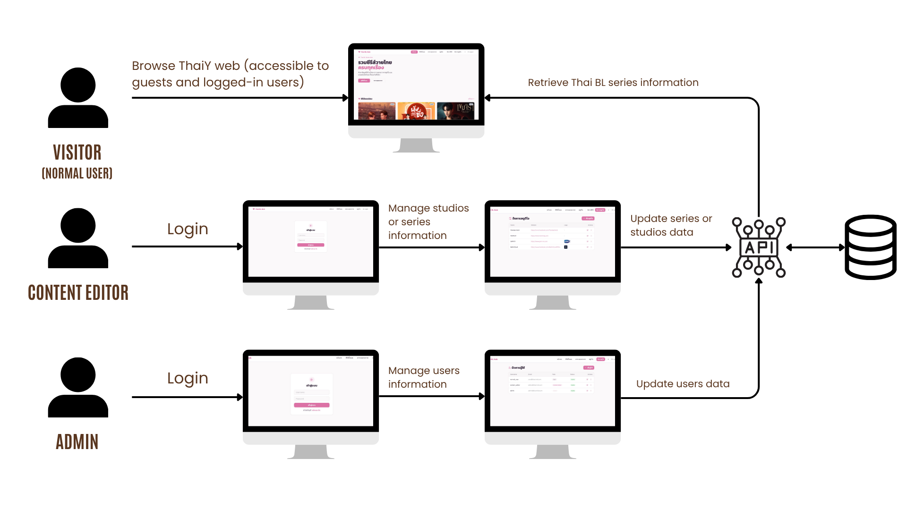

### Software Architecture
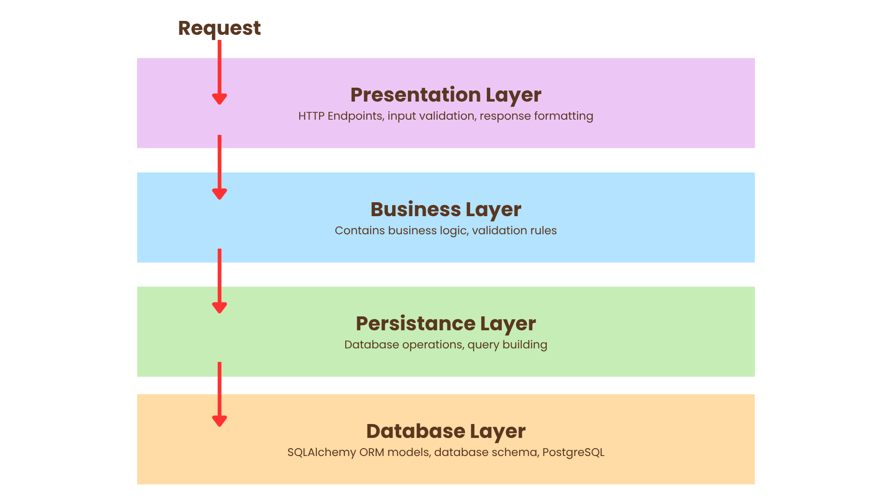
| Layer | Purpose | Components |
|-------|---------|------------|
| **Presentation** | HTTP endpoints & routing | `app/api/*.py` (auth, series, studios, user) |
| **Business** | Core application logic, validation, business rules | `app/business/*.py` (AuthService, SeriesService, StudioService, UserService) |
| **Persistence** | Database query abstraction & operations | `app/persistence/*.py` (SeriesRepository, StudioRepository, UserRepository) |
| **Database** | Data storage & relationships | `app/database/*.py` (PostgreSQL + SQLAlchemy ORM) |

---

## User Roles & Permissions

ThaiY supports three user roles with different access levels:

### 1. **Admin**
- **Resposibility:**
  User account management (create, update, delete, role assignment)
- **Access:** `/admin/users`, `/profile`, `/series`, `/schedule`, `/studios`, `/login`

### 2. **Content Editor**
- **Resposibilities:**
  - Create, update, and delete series
  - Manage studio information
  - Update broadcasting schedules
  - Add/remove streaming platform
- **Access:** `/editor/series`, `/editor/studios`, `/profile`, `/series`, `/schedule`, `/studios`, `/login`

### 3. **Normal User**
- **Permissions:**
  - Browse and search series
  - View series details
  - View broadcasting schedules
  - Access streaming platforms and studios
- **Access:** `/series`, `/schedule`, `/studios`, `/profile`, `/login`, `/register`

---

## Technology Stack

### **Backend**
| Technology     |              Purpose              |
|----------------|-----------------------------------|
| **FastAPI**    | Modern Python web framework       | 
| **SQLAlchemy** | ORM for database abstraction      | 
| **PostgreSQL** | Relational database               |
| **Pydantic**   | Data validation & serialization   |
| **JWT**        | Authentication tokens             |
| **Python**     | Programming language              |

### **Frontend**
| Technology |      Purpose | 
|------------|--------------|
| **Vue.js** | Progressive JavaScript framework |
| **Pinia** | State management store |
| **Axios** | HTTP client |
| **Tailwind CSS** | Utility-first CSS framework |
| **Vite** | Frontend build tool & dev server |

### **Deployment**
| Technology | Purpose |
|------------|---------|
| **Docker** | Containerization for consistent environments |

---

## Installation & Setup

### Prerequisites
- Docker & Docker Compose (recommended)
- OR: Python 3.10+, Node.js 20+, PostgreSQL

### Option 1: Docker Setup (Recommended)

```bash
# 1. Clone the repository
git clone https://github.com/primpunnapa/thaiy_central.git
cd thaiy

# 2. Create .env file with database credentials
cat > .env << EOF
POSTGRES_USER=your-db-user
POSTGRES_PASSWORD=your-db-password
POSTGRES_DB=your-db-name
ENVIRONMENT=development
SECRET_KEY=your-secret-key-change-in-production
EOF

# 3. go to frontend and install dependencies
cd frontend
npm install

# 4. go back to root and start all services
cd ..
docker-compose up --build -d

# 3. Wait for PostgreSQL to initialize, then seed the database
docker-compose exec backend python seed.py

# 4. Verify all services are running
docker-compose ps

# 5. View logs (optional)
docker-compose logs -f

# Services will be available at:
# - Frontend: http://localhost:5173
# - Backend API: http://localhost:8000
# - Database: localhost:5432
```

### Option 2: Local Setup (Without Docker)

#### Backend Setup
```bash
# 1. Navigate to backend directory
cd backend

# 2. Create and activate virtual environment
python3 -m venv venv
source venv/bin/activate  # On Windows: venv\Scripts\activate

# 3. Install dependencies
pip install -r requirements.txt

# 4. Create PostgreSQL database (must have PostgreSQL installed and running)
# Using psql:
psql -U postgres -c "CREATE DATABASE thaiy_db;"

# Or using createdb:
createdb -U postgres thaiy_db

# 5. Create .env file
cat > .env << EOF
POSTGRES_USER=your-db-user
POSTGRES_PASSWORD=your-db-password
POSTGRES_DB=your-db-name
ENVIRONMENT=development
SECRET_KEY=your-secret-key-change-in-production
EOF

# 6. Seed initial data (optional)
python seed.py

# 7. Start FastAPI development server
fastapi dev app/main.py

# Backend API will be available at http://localhost:8000
# Interactive API docs: http://localhost:8000/docs
```

#### Frontend Setup
```bash
# 1. Open a new terminal and navigate to frontend directory
cd frontend

# 2. Install dependencies
npm install

# 3. Start development server
npm run dev

# Frontend will be available at http://localhost:5173
```

---

## Running the System

### With Docker Compose

```bash
# Start all services
docker-compose up -d

# View logs
docker-compose logs -f

# Seed database (one-time after first start)
docker-compose exec backend python seed.py

# Stop all services
docker-compose down

# Stop and remove all volumes
docker-compose down -v


```

### Without Docker (Terminal Commands)

**Terminal 1 - Backend:**
```bash
cd backend
source venv/bin/activate
fastapi dev app/main.py
# Runs on http://localhost:8000
```

**Terminal 2 - Frontend:**
```bash
cd frontend
npm run dev
# Runs on http://localhost:5173
```

### Access the Application

1. **Frontend (User Interface):** http://localhost:5173
   - Browse series, schedules, studios
   - Login to access admin/editor features

2. **Backend API Documentation:** http://localhost:8000/docs
   - Interactive Swagger UI
   - Test API endpoints directly

3. **Default Test Credentials** (from seed.py):
   - **Admin:** 
     - Username: `admin`
     - Password: `admin123`
     - Role: `admin`
   - **Editor:**
     - Username: `content_editor`
     - Password: `editor123`
     - Role: `editor`
   - **Normal User:**
     - Username: `normal_user`
     - Password: `user123`
     - Role: `normal`

---

## API Documentation

### Authentication Endpoints
```
POST /api/auth/login
  - Body: { "username": string, "password": string }
  - Returns: { "access_token": JWT, "user": UserObject }

POST /api/auth/logout
  - Clears authentication

GET /api/auth/me
  - Returns: Current user information

POST /api/auth/register
  - Body: { "username": string, "email": string, "password": string }
```

### Series Endpoints
```
GET /api/series
  - Public: List all series

GET /api/series/{id}
  - Public: Get series details

POST /api/series
  - Editor: Create series

PUT /api/series/{id}
  - Editor: Update series

DELETE /api/series/{id}
  - Editor: Delete series

GET /api/series/schedule
  - Public: Get series grouped by air day
```

### Studios Endpoints
```
GET /api/studios
  - Public: List all studios

POST /api/studios
  - Editor: Create studio

PUT /api/studios/{id}
  - Editor: Update studio

DELETE /api/studios/{id}
  - Editor: Delete studio
```

### Users Endpoints (Admin Only)
```
GET /api/users
  - Admin: List all users

GET /api/users/{id}
  - Admin: Get user details

POST /api/users
  - Admin: Create user

PUT /api/users/{id}
  - Admin: Update user

DELETE /api/users/{id}
  - Admin: Delete user
```
### Example API Calls
1. Login
```
curl -X 'POST' \
  'http://localhost:8000/api/auth/login' \
  -H 'accept: application/json' \
  -H 'Content-Type: application/json' \
  -d '{
  "username": "admin",
  "password": "admin123"
}'
```
Response (code : 200):
```
{
  "access_token": "xxxxxx",
  "token_type": "bearer",
  "user": {
    "id": 3,
    "username": "admin",
    "email": "admin@blcentral.com",
    "full_name": "System Admin",
    "role": "admin",
    "is_active": true,
    "created_at": "2026-04-11T14:34:37.155641Z",
    "last_login": "2026-04-13T07:21:55.310225Z"
  }
}
```

2. Get all series
```
curl -X 'GET' \
  'http://localhost:8000/api/series/?skip=0&limit=20' \
  -H 'accept: application/json'
```

Response (code : 200):
```
[
  {
    "id": 1,
    "title_th": "มีสติหน่อยคุณธีร์",
    "title_en": "Me and Thee",
    "poster_url": "meandthee.jpg",
    "status": "completed",
    "air_day": "Saturday",
    "air_time": "20:30"
  },
  {
    "id": 2,
    "title_th": "นิ่งเฮียก็หาว่าซื่อ",
    "title_en": "Cutie Pie Series",
    "poster_url": "cutiepie.jpg",
    "status": "completed",
    "air_day": "monday",
    "air_time": "22:30"
  }
]
```
3. Get specific series detail
```
curl -X 'GET' \
  'http://localhost:8000/api/series/1' \
  -H 'accept: application/json'
```
Response (code : 200)
```
{
  "title_th": "มีสติหน่อยคุณธีร์",
  "title_en": "Me and Thee",
  "description": "A chance meeting leads photographer Peach to mentor wealthy businessman Thee, whose obsession with TV dramas and disconnect from real-world values needs a serious reality check.",
  "release_year": 2025,
  "poster_url": "meandthee.jpg",
  "status": "completed",
  "air_day": "Saturday",
  "air_time": "20:30",
  "studio_id": 1,
  "platforms": [
    "iqiyi"
  ],
  "id": 1,
  "views": 169,
  "created_at": "2026-04-11T14:34:37.158125Z",
  "updated_at": "2026-04-13T07:03:38.440048Z",
  "studio": {
    "name": "GMMTV",
    "website_url": "https://www.gmm-tv.com",
    "logo_url": "https://upload.wikimedia.org/wikipedia/commons/3/39/GMMTV_Logo.svg",
    "id": 1
  }
}
```
4. Create studio
```
curl -X 'POST' \
  'http://localhost:8000/api/studios/' \
  -H 'accept: application/json' \
  -H 'Content-Type: application/json' \
  -d '{
  "name": "string",
  "website_url": "string",
  "logo_url": "string"
}'
```
---

## Screenshots

> - Home page with series
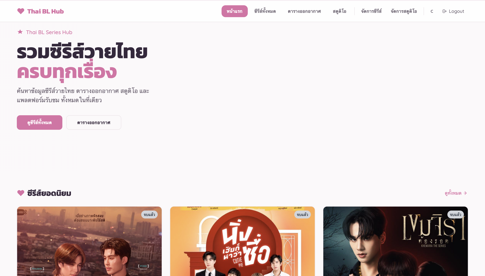
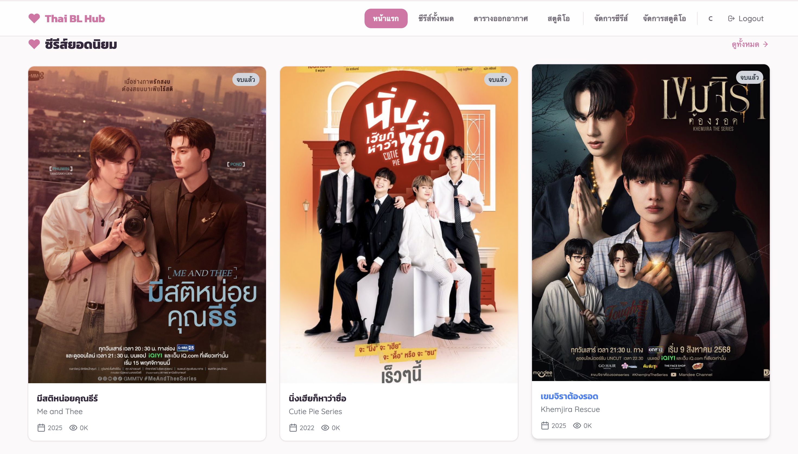
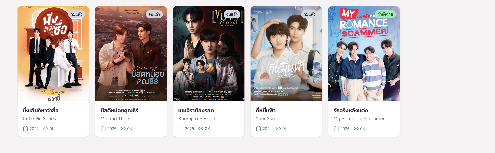
> - Series list with search & filters
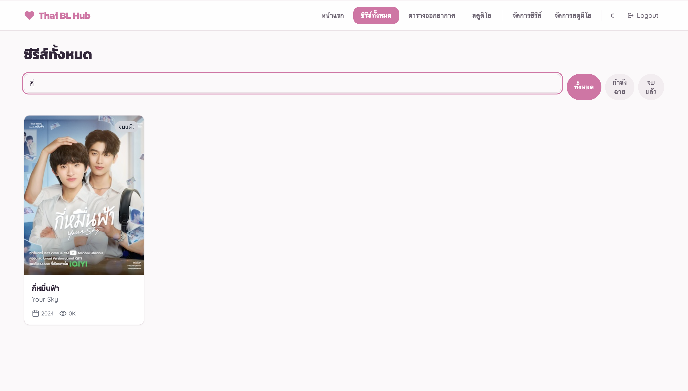
> - Series detail page with platforms
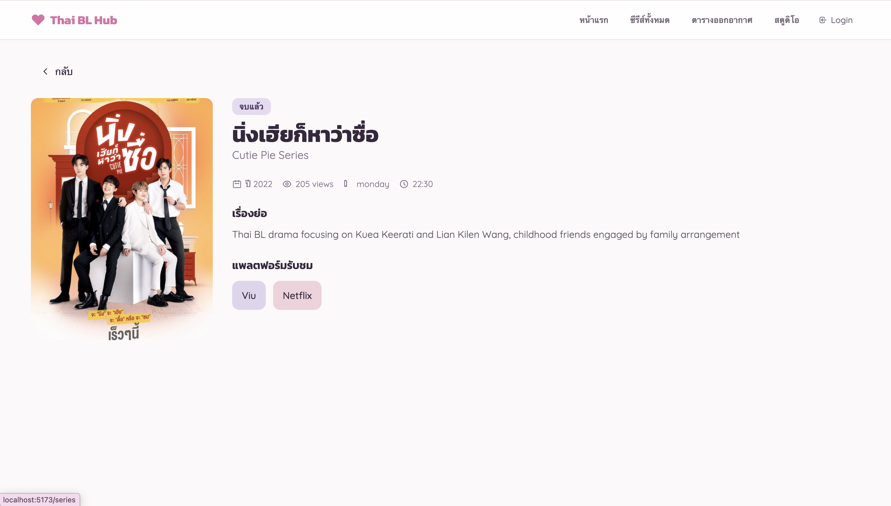
> - Schedule page grouped by day
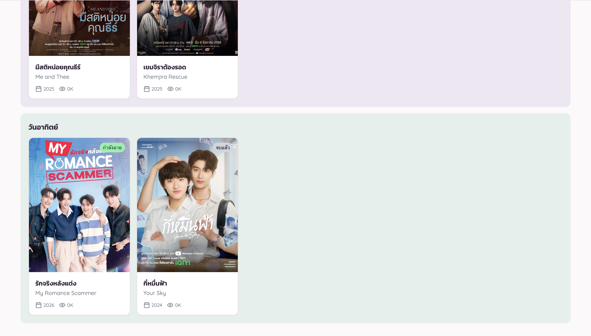
> - Login/Register pages
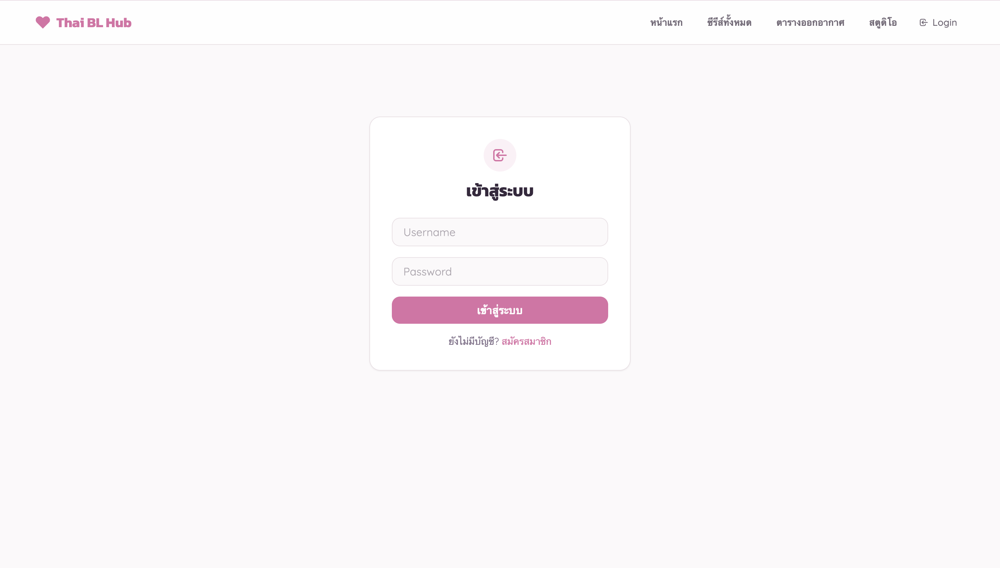
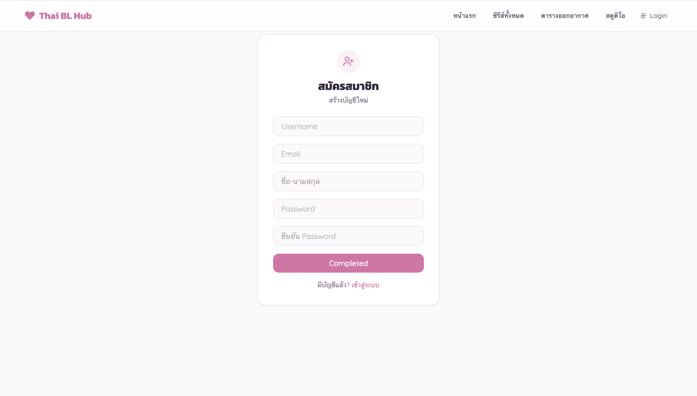
> - Profile page with user info
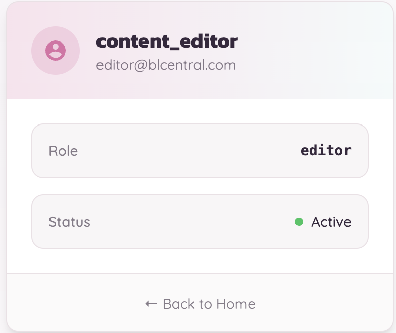
> - Admin user management page
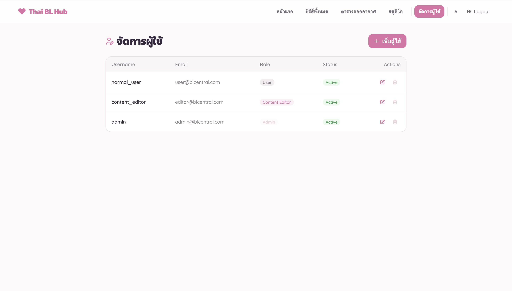
> - Editor series management 
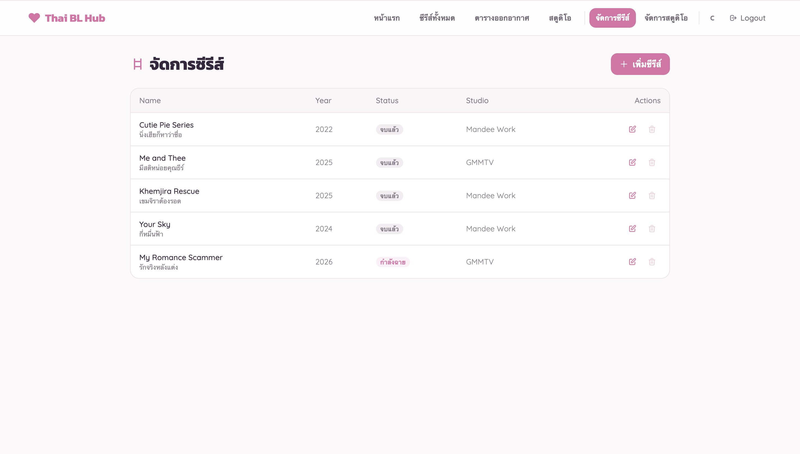
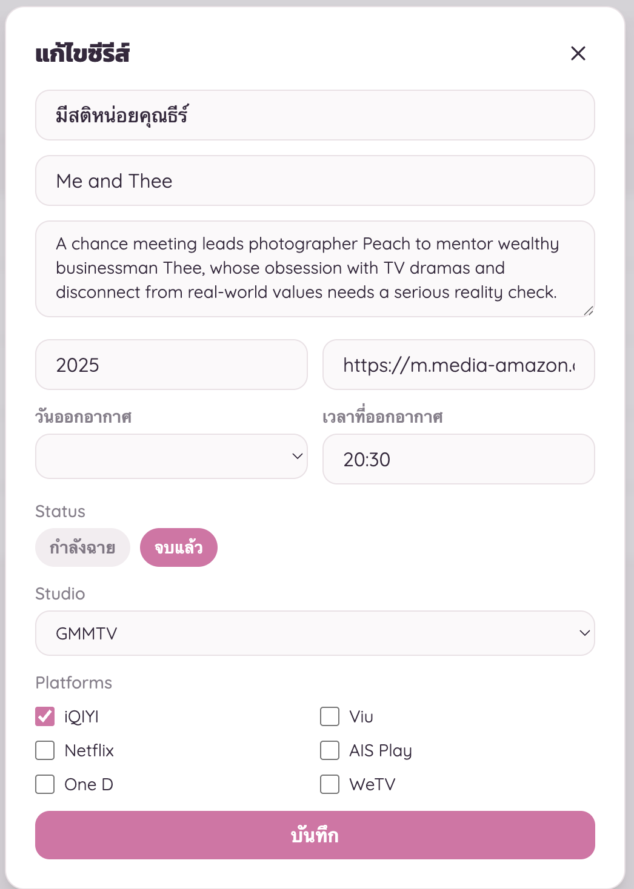
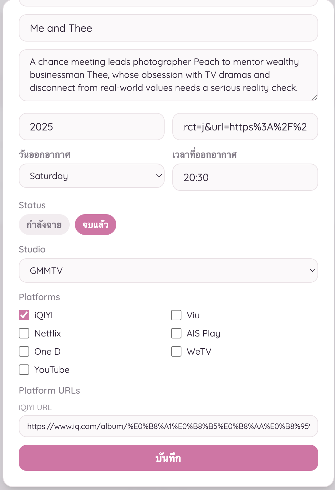
> - Studios page with platform badges
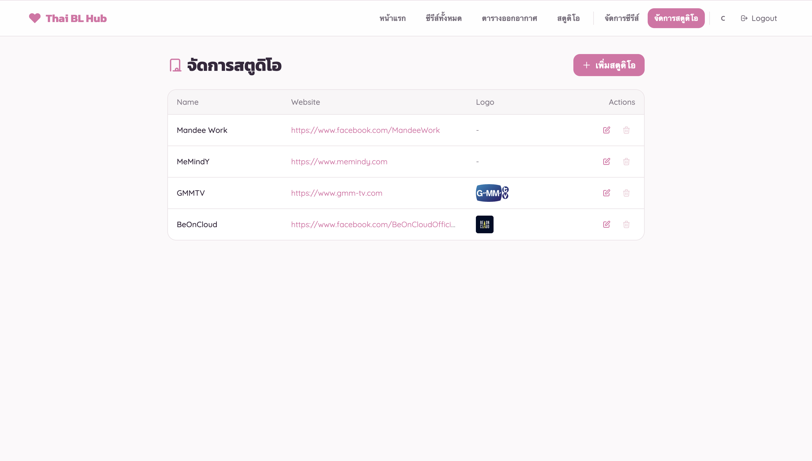